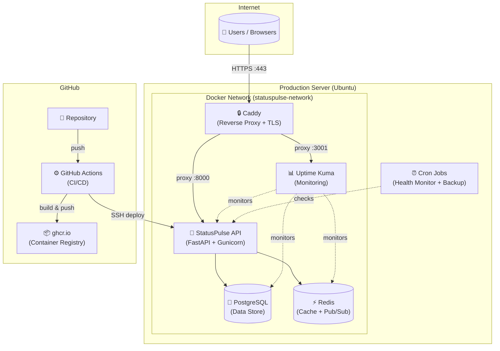

# StatusPulse — Lightweight Status Page & Health Monitoring API

> A production-grade infrastructure setup for the StatusPulse API with Docker, CI/CD, HTTPS, monitoring, and Infrastructure as Code.

---

## Architecture



---

## Prerequisites

| Tool | Install Command | Purpose |
|------|----------------|---------|
| Docker Desktop | [docker.com](https://docker.com) | Run containers |
| Git | `brew install git` | Version control |
| Make | Pre-installed on macOS | Build shortcuts |

---

## Quick Start — Run Locally

```bash
# 1. Clone the repository
git clone https://github.com/YOUR_USERNAME/statuspulse.git
cd statuspulse

# 2. Create environment file
cp .env.example .env
# Edit .env and set your passwords

# 3. Build and start all services
make up

# 4. Verify everything is healthy
make test

# 5. Open in browser
open http://localhost:8000/docs    # Swagger UI
open http://localhost:8000/health  # Health check
```

### Available Make Commands

| Command | Description |
|---------|-------------|
| `make build` | Build the Docker image |
| `make up` | Start all services |
| `make down` | Stop all services |
| `make logs` | Tail logs from all services |
| `make test` | Health check via curl |
| `make clean` | Remove containers, images, volumes |
| `make shell` | Open bash in the app container |

---

## Deploy to Production

### 1. Provision a Server
Use Oracle Cloud Free Tier, AWS Free Tier, or a local VM (VirtualBox/Multipass).

### 2. Get a Domain
Register a free subdomain at [DuckDNS](https://duckdns.org) and point it to your server IP.

### 3. Configure & Deploy with Ansible
```bash
cd ansible

# Edit inventory with your server IP
nano inventory.ini

# Edit variables (domain, SSH key path, passwords)
nano vars.yml

# Run the playbook
ansible-playbook -i inventory.ini playbook.yml
```

### 4. Manual Deployment (Alternative)
```bash
# SSH into your server
ssh deploy@your-server -p 2222

# Clone and start
git clone https://github.com/YOUR_USERNAME/statuspulse.git
cd statuspulse
cp .env.example .env
nano .env  # Set real passwords
docker compose up -d
```

---

## CI/CD Pipeline

### CI (on every push/PR to `main`)
1. **Lint** Python code with `ruff`
2. **Scan** Dockerfile with `hadolint`
3. **Build** Docker image
4. **Test** — start full stack and run integration tests
5. **Upload** test results as artifact

### CD (on push to `main`, after CI passes)
1. **Build** and tag image with commit SHA + `latest`
2. **Push** to GitHub Container Registry (`ghcr.io`)
3. **Deploy** to server via SSH
4. **Health check** — verify `/health` returns 200
5. **Rollback** automatically if health check fails
6. **Notify** via GitHub Issue comment

### Required GitHub Secrets
Set in repo → Settings → Secrets → Actions:

| Secret | Value |
|--------|-------|
| `SERVER_HOST` | Your server IP |
| `SERVER_USER` | `deploy` |
| `SERVER_SSH_KEY` | Private SSH key |
| `SERVER_SSH_PORT` | `2222` |
| `SERVER_DOMAIN` | `your-name.duckdns.org` |

---

## Monitoring & Alerting

### Uptime Kuma
- **URL:** `https://status.your-domain.duckdns.org`
- **Monitors:** StatusPulse API, PostgreSQL, Redis, TLS certificate
- **Check interval:** 60 seconds
- **Alerts:** 2 channels configured (Discord + Email)

### Health Monitor Script
Runs every 5 minutes via cron:
- Checks `/health` endpoint (HTTP 200 + valid JSON)
- Checks disk usage (alert > 80%)
- Checks memory usage (alert > 90%)
- Checks all Docker containers are running
- Checks TLS certificate expiry (alert < 14 days)
- Sends alerts via webhook

---

## Backup & Restore

### Automatic Backups
- **Schedule:** Daily at 2:00 AM (cron)
- **Retention:** Last 7 backups kept, older ones rotated
- **Format:** `statuspulse_db_YYYY-MM-DD_HHMMSS.sql.gz`

### Manual Backup
```bash
bash scripts/backup.sh
```

### Restore from Backup
```bash
# Decompress the backup
gunzip statuspulse_db_2024-01-15_020000.sql.gz

# Restore to PostgreSQL
docker exec -i statuspulse-db psql -U postgres statuspulse < statuspulse_db_2024-01-15_020000.sql
```

---

## API Endpoints

| Method | Endpoint | Description |
|--------|----------|-------------|
| GET | `/` | Service info |
| GET | `/health` | Health check (API + DB + Redis) |
| GET | `/docs` | Swagger UI |
| POST | `/services` | Register a service to monitor |
| GET | `/services` | List all services |
| POST | `/incidents` | Report an incident |
| GET | `/incidents` | List all incidents |

---

## Troubleshooting

### Services won't start
```bash
# Check logs
make logs

# Verify .env file exists
cat .env

# Restart everything
make down && make up
```

### Database connection errors
```bash
# Check if PostgreSQL is healthy
docker compose ps db

# Connect to DB manually
docker compose exec db psql -U postgres statuspulse
```

### Port already in use
```bash
# Find what's using the port
lsof -i :8000

# Change port in .env
APP_PORT=8001
```

### Health check shows "degraded"
```bash
# Check which service is unhealthy
curl localhost:8000/health | python3 -m json.tool

# Restart the unhealthy service
docker compose restart db    # or redis
```

### Docker image too large
```bash
# Check image size
docker images statuspulse

# Rebuild with no cache
docker compose build --no-cache
```

---

## Repository Structure
```
statuspulse/
├── .github/workflows/
│   ├── ci.yml              # CI pipeline
│   └── deploy.yml          # CD pipeline
├── app/
│   ├── main.py             # StatusPulse API (DO NOT MODIFY)
│   └── requirements.txt    # Python dependencies
├── ansible/
│   ├── inventory.ini       # Server list
│   ├── playbook.yml        # Configuration playbook
│   ├── vars.yml            # Variables
│   └── README.md           # Ansible docs
├── caddy/
│   └── Caddyfile           # Reverse proxy config
├── scripts/
│   ├── deploy.sh           # Zero-downtime deploy
│   ├── backup.sh           # Database backup + rotation
│   └── health-monitor.sh   # Cron health checks
├── tests/
│   └── test_integration.sh # Integration tests
├── .dockerignore
├── .env.example
├── .gitignore
├── docker-compose.yml      # Local development
├── Dockerfile              # Multi-stage production build
├── Makefile                # Build shortcuts
├── README.md               # This file
└── SECURITY.md             # Security documentation
```

---

## License
MIT
